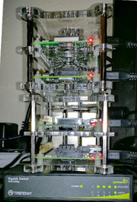

# Pi-Kube - My Kubernetes Cluster
A collection of notes and scripts for how I set up my personal Kubernetes cluster on Raspberry Pi 3.



Because these instructions have been repeated ad nauseum all over the Interwebs, I used the following site and added 
a bit of commentary.

As of 7/4/2018, there is still something at issue with my cluster - the Dashboard cannot "find" Heapster, so it 
appears the WeaveNET and KubeDNS are non-functional. (I also have what appears to be a couple of flakey Pi, so... )

# Quick Setup Instructions
This [setup guide](http://www.cristiandima.com/running-kubernetes-on-a-raspberry-pi-cluster/) by Christian Dima is 
pretty typical and appears to work with the newer OS and Docker.

## Post Docker Install
If desired, enable a local insecure registry for your images:
- Edit `/etc/docker/daemon.json`
- Add `{ "insecure-registries":["<hostnane>:<port>"] }`

## kubeadm
I used this command instead of the "stock":
```bash
kubeadm init --kubernetes-version "v1.9.6" --token-ttl=0
```
## Install the dashboard
Same commands, except I added a NodePort service to access the dashboard without requiring `proxy`
   - ```bash
     # pulls the recommended version
     GITLOC="https://raw.githubusercontent.com/kubernetes/dashboard/master/src/deploy/"
     kubectl apply -f "$GITLOC/recommended/kubernetes-dashboard-arm.yaml"
     # set up special admin by-pass for authentication
     kubectl apply -f setup/dashboard-admin.yaml
     # add a service to expose across all nodes (see table below)
     kubectl apply -f setup/dashboard-service.yaml
     ```
     
### Additional Monitoring
For more bells and whistles for monitoring, install Heapster/InfluxDB/Grafana. The files in the `setup` directory
were copied (and modified) from the
[Heapster/Influx](https://github.com/kubernetes/heapster/blob/master/docs/influxdb.md) folks themselves.
  - The `Heapster` artifacts should be applied as a minimum - this will make the _Kubernetes_ dashboard prettier...
  - Slightly customized _Cluster_ and _Pod_ Grafana dashboards are in `setup/grafana`

## RBAC
Kubernetes now runs by default in a "locked-down" authentication/authorization configuration. If you want to remove the
security restrictions (_really_ bad idea for a prod system), you can apply
```bash
kubectl create clusterrolebinding permissive-binding \
  --clusterrole=cluster-admin \
  --user=admin \
  --user=kubelet \
  --group=system:serviceaccounts
```

# Services
Deploy some of this stuff with the `k8s-apply.sh` script. Some of the images are also available in the individual
directories. No guarantees.

**Note:** services are _not_ using `Ingress` and ELB is not available, so `Node Port` is used for access.

| App        | Description | Port Description | Container Port | Node Port |
|------------|-------------|------------------|----------------|-----------|
| Kubernetes | Web UI      | UI               |  8443          | 31080 |
| Grafana    | Monitoring  | UI               |    80          | 31082 |
| Influxdb   | Monitoring  | DB               |  8086          | 31086 |
| gogs       | github-lite | Client/SSH       |    22          | 30022 |
|            |             | UI               |  3000          | 30023 |
| Rabbit     | MOM         | Client           |  5672          | 30100 |
|            |             | Management UI    | 15672          | 30101 |
| CouchDB    | NoSQL DB    | REST/UI          |  5984          | 30200 |
## GOGS
[GOGS](https://github.com/gogits/gogs) is a really simple, self-hosted GitHub-like server. This example is setup to
use a `Persisent Volume` mount via NFS. The "hardest" part is setting up the `git` remotes to use the off-color SSH
port correctly. In order to do this, you need to use the SSH "form" of the Git URL:

> ssh://git@<kube.node>:30022/<org>/<project>.git

## RabbitMQ
A very simple image that relies more on environment variables than a configuration. Currently makes a 3.6.x image,
including the `autocluster` v 0.10 plugin and enables the _management_ plugin by default.

The Dockerfile relies on _build-arg_ argument passing, so a more recent version of `docker` is required to build it.

_Note:_ I tried using `ADD` to directly copy in the download files, but that seemed to have borked some permissions.

### Kubernetes
To run the cluster, the `auth` artifacts need to be applied first so that the auto-cluster plugin can access the
Kubernetes API. Note that the authorization is overly broad and should really be dialed down.

## Grafana
The deployment uses the "stock" K8S dashboards. There are a couple of customized dashobards in `setup/grafana`, as well.

## CouchDB
[Apache NoSQL](http://couchdb.apache.org/) database, using an NFS mount point. Once installed, you should be able to 
see the web UI at http://hostname:30200/_util/ui.

Note that this setup has *NOT* been tried due to the DNS issues mentioned at the top.

# Hints and Tricks
- I couldn't remember which Pi was which, so I used the following to turn on the Disk Activity LED on a node:
  ```bash
  echo none >/sys/class/leds/led0/trigger # to turn off the default behavior
  echo 1 >/sys/class/leds/led0/brightness # turn the LED on
  echo 0 /sys/class/leds/led0/brightness # turn it off
  echo mmc0 /sys/class/leds/led0/trigger # restore original behavior
  ```
